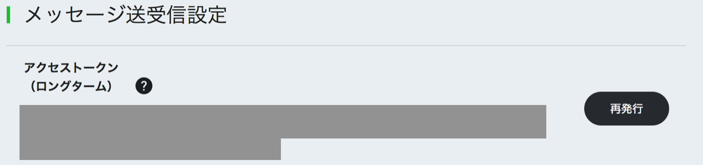

# LiffSelector

Welcome to your new gem! In this directory, you'll find the files you need to be able to package up your Ruby library into a gem. Put your Ruby code in the file `lib/liff_selector`. To experiment with that code, run `bin/console` for an interactive prompt.

## Installation

Add this line to your application's Gemfile:

```ruby
gem 'liff_selector'
```

And then execute:

    $ bundle

Or install it yourself as:

    $ gem install liff_selector

## Introduction

setup envfile. write assign enviroment or dotfile variable line_access_token.
line_acces_token write next figure place.



setting envrioment variable in shell.

```
$ export LINE_CHANNEL_TOKEN="line_access_token"
```

## Usage

### create
create new liff html. give file name

```
$ bundle exec liff_select create index
> > [SUCESS] make ./index
```

### upload
upload new liff application. give type, url

```
$ bundle exec liff_select upload compact https://example.com
> make liff app
> [SUCESS] make app
> app uri : line://app/XXXXXXXXXX-XXXXXXXX
```

### show
display all liff applications.

```
$ $ bundle exec liff_select show
id liffId   type  url
1. 1578425738-81wbQ6WM  full  https://example.com
2. 1578425738-8AM1APKY  tall  https://esample.com/1
```

### delete
delete liff application

```
$ bundle exec liff_select delete 1
1. XXXXXXXXXX-XXXXXXXX  compact https://example.com
> [SUCESS] delete app
```

### same
display same type and url liff applications.

```
$ bundle exec liff_select same
> "type": full, "url": https://example.com
 - id: 1, liffId: XXXXXXXXXX-XXXXXXXX
> "type": tall, "url": https://esample.com/1
 - id: 2, liffId: XXXXXXXXXX-XXXXXXXX
```

### clean
delete same type and url applications

```
$ bundle exec liff_select clean
> "type": tall, "url": https://liff-a4geru.c9users.io/charge
 - id: 1, liffId: 1578425738-8AM1APKY
> "type": compact, "url": https://liff-a4geru.c9users.io/
 - id: 2, liffId: 1578425738-GBp65o2R
 - id: 3, liffId: 1578425738-WeqQXxKp
 - id: 5, liffId: 1578425738-yLqlrmVE
> "type": compact, "url": https://liff-a4geru.c9users.io/charge
 - id: 4, liffId: 1578425738-YbD5yxAq
>> delete "id": 3, "type": compact, "url": https://liff-a4geru.c9users.io/
>> delete "id": 5, "type": compact, "url": https://liff-a4geru.c9users.io/
> [SUCESS] delete app
```

## License

The gem is available as open source under the terms of the [MIT License](https://opensource.org/licenses/MIT).
